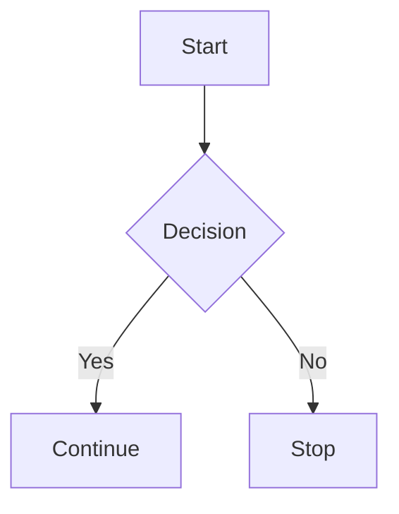
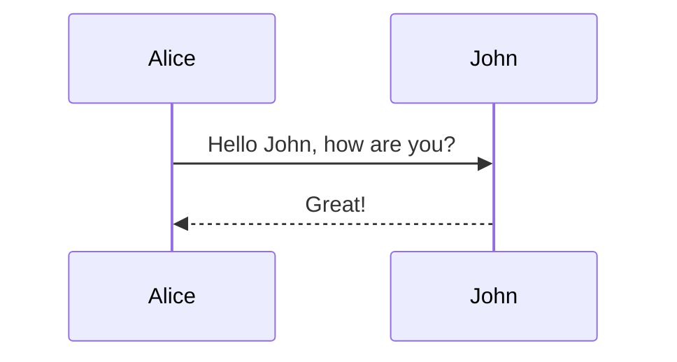

# Static Obsidian — Test Document

## 1. Standard Markdown

**Bold text** and _italic text_ and ~~strikethrough~~.

- **Unordered list item**
- Another item
  - Nested item

1. Ordered list item
2. Another item

[Link to example.com](https://example.com)

`inline code`

```
code block
```

1. - test

---

---

## 2. GFM Tables

| Header 1 | Header 2 |
| -------- | -------- |
| Cell 1   | Cell 2   |
| Cell 3   | Cell 4   |

## 3. Highlights

==highlighted text== and ==more highlights==

## 4. Tags

#tag #important #test #obsidian

## 5. Wiki-Links

[[another note]] and [[target page]]

## 6. Callouts

> [!note] This is a note callout
> Content inside the callout with **bold text**

> [!danger] danger
> Content inside the callout with **bold text**

> [!warning] Warning
> Be careful with this!

> [!tip]
> Tip without custom title

> [!info] Info
> Some informational content

## 7. Blockquotes (regular)

> Regular blockquote
> Multiple lines

## 8. LaTeX (KaTeX)

Inline equation: $E = mc^2$

Display equation:

$$
\int_{-\infty}^{\infty} e^{-x^2} \, dx = \sqrt{\pi}
$$

Matrix:

$$
\begin{pmatrix}
a & b \\
c & d
\end{pmatrix}
$$

## 9. Mermaid





## 10. Image Placeholder

![[image.png]]

_(paste/drop an image above to test)_

## 11. Combined Syntax

==Highlighted text with #tag and [[wikilink]]==

> [!info] Callout with $x^2$ LaTeX inside
> And a ==highlight== too

## 12. Edge Cases

{pagebreak}
Empty callout:

> [!info]

Nested lists with formatting:

- **Bold** and _italic_ and `code`
- ==highlighted list item==
- [[wikilink in list]]

Horizontal rule with tags:

---

#tag at end

---
