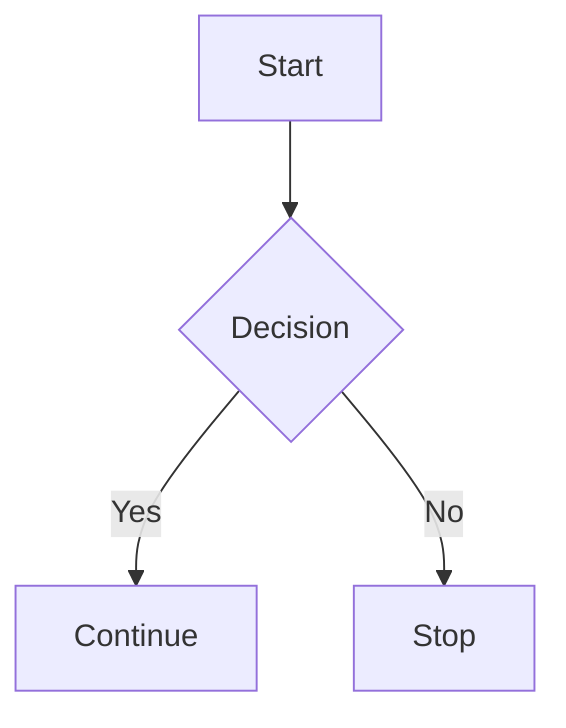
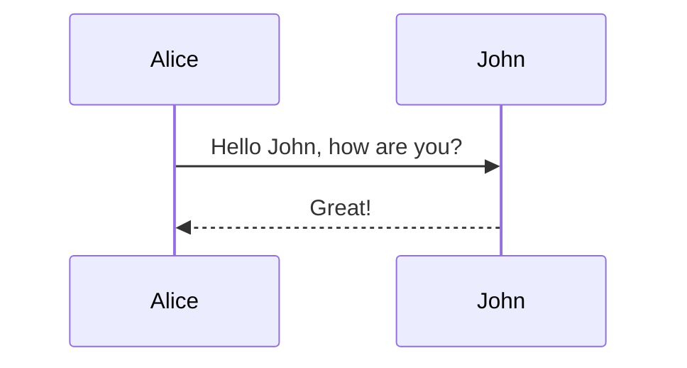

{toc:3}

# Static Obsidian — Test Document

## 0. Table of Contents

The line at the top (`{toc:3}`) generates this TOC limited to h1–h3.
`{toc}` without a depth shows all headings.

## 1. Standard Markdown

**Bold text** and *italic text* and ~~strikethrough~~.

- **Unordered list item**
- Another item
  - Nested item

1. Ordered list item
2. Another item

[Link to example.com](https://example.com)

`inline code`

```
code block
```

---

## 2. GFM Tables

| Header 1 | Header 2 |
| -------- | -------- |
| Cell 1   | Cell 2   |
| Cell 3   | Cell 4   |

## 3. Highlights

==highlighted text== and ==more highlights==

## 4. Tags

#tag #important #test #obsidian

## 5. Wiki-Links

[[another note]] and [[target page]]

## 6. Callouts

> [!note] This is a note callout
> Content inside the callout with **bold text**

> [!danger] Danger
> Content inside the callout with **bold text**

> [!warning] Warning
> Be careful with this!

> [!tip]
> Tip without custom title

> [!info] Info
> Some informational content

## 7. Blockquotes (regular)

> Regular blockquote
> Multiple lines

## 8. LaTeX (KaTeX)

Inline equation: $E = mc^2$

Display equation:

$$
\int_{-\infty}^{\infty} e^{-x^2} \, dx = \sqrt{\pi}
$$

Matrix:

$$
\begin{pmatrix}
a & b \\
c & d
\end{pmatrix}
$$

## 9. Mermaid





## 10. Code Snippets

```javascript
console.log('Hello from JavaScript');
```

```python
print("Hello from Python")
```

```bash
echo "Hello from Bash"
```

```html
<h1>Hello from HTML</h1>
```

## 11. Image Placeholder

![[image.png]]

_(paste/drop an image above to test)_

### 11a. Image with Caption

![[image.png|My Caption]]

_(paste an image — the text after the pipe becomes a styled caption below the image)_

### 11b. Image with Dimensions + Caption

![[image.png|300x200|Resized with caption]]

_(both width/height and caption are picked up automatically)_

### 11c. Image with Width + Caption

![[image.png|300|Width and caption]]

## 12. Page Break

{pagebreak}

_(Page break renders as a visual separator in preview, and forces a page break when exporting to PDF)_

## 13. Combined Syntax

==Highlighted text with #tag and [[wikilink]]==

> [!info] Callout with $x^2$ LaTeX inside
> And a ==highlight== too

## 14. Edge Cases

Empty callout:

> [!info]

Nested lists with formatting:

- **Bold** and *italic* and `code`
- ==highlighted list item==
- [[wikilink in list]]

Horizontal rule with tags:

---

#tag at end

---

## Keyboard Shortcuts

| Shortcut       | Action       |
|----------------|--------------|
| Ctrl+B         | Bold         |
| Ctrl+I         | Italic       |
| Ctrl+H         | Highlight    |
| Ctrl+Z         | Undo         |
| Ctrl+Y         | Redo         |
| Ctrl+Shift+Z   | Redo (alt)   |

## Toolbar

- **A▾** — Format submenu: Bold, Italic, Highlight
- **H▾** — Heading submenu: H1–H6
- **•**, **1.** — Bullet / numbered list
- **—** — Horizontal rule
- **[[ ]]** — Wiki-link
- **▣▾** — Callout submenu
- **S▾** — Snippets submenu (code blocks, mermaid, latex, image embed, link, todo, page break)
- **⊞▾** — Table submenu
- **Files**, **Images**, **Export**, **⚙** — file management
